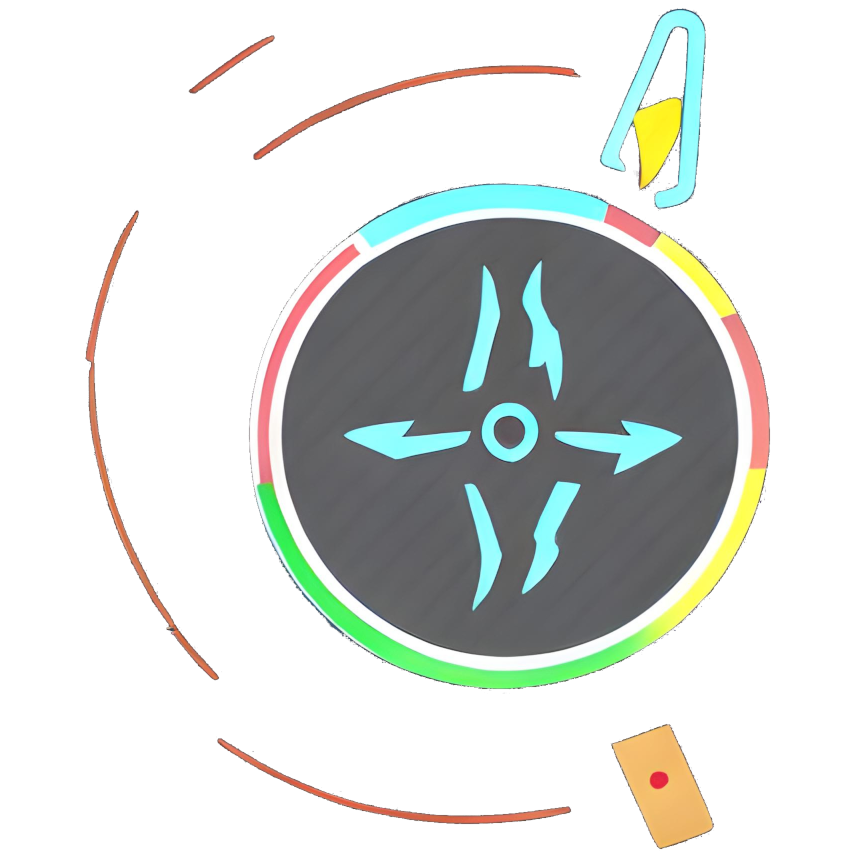

# Power Remote for OpenLP
Power Remote is an alternative web remote for [OpenLP](https://openlp.org). It enables fast movement between slides with a unique keyboard layout. If you have OpenLP running, you can demo it here: [powerremote.wingysam.xyz](http://powerremote.wingysam.xyz). (The site is not delivered by HTTPS to avoid mixed active content being blocked)

# About Developer
Hi, I'm Wingy. This is a project I made because I didn't like the trackpad of the laptop at my church. My website is [samwing.dev](https://samwing.dev). Please [hire me](https://samwing.dev/hire).

