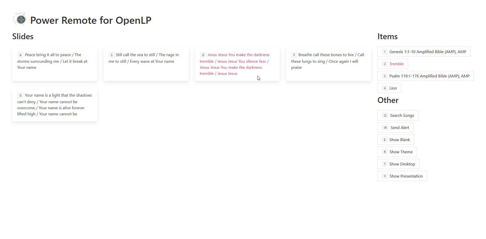

# Power Remote for OpenLP
Power Remote is an alternative web remote for [OpenLP](https://openlp.org). It enables fast movement between slides with a unique keyboard layout.

## Demo
If you have OpenLP running, you can demo Power Remote at [powerremote.samwing.dev](https://powerremote.samwing.dev). Because it's served by HTTPS, you can't access "non-secure" APIs with it, so accessing the OpenLP remote API of a device on your local network won't work. If you're on Firefox, you can use [powerremote.wingysam.xyz](http://powerremote.wingysam.xyz) which is served over plain HTTP to avoid "mixed active content" being blocked. If you're on Chrome, this approach is also blocked in the name of security.

# About Developer
Hi, I'm Wingy. This is a project I made because I didn't like the trackpad of the laptop at my church. My website is [samwing.dev](https://samwing.dev). Please [hire me](https://samwing.dev/hire).

